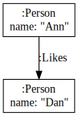

# Quick overview of what PREC can do


PREC enables to convert PG into RDF. Unlike other tools, PREC enables the user to choose the modelization.

## Quick example


<table>

<tr>
<td>

</td>

<td>

```ttl
PREFIX prec: <http://bruy.at/prec#>
PREFIX pvar: <http://bruy.at/prec-trans#>
PREFIX ex:   <http://example.org/>
PREFIX rdf:  <http://www.w3.org/1999/02/22-rdf-syntax-ns#>

prec:this_is a prec:prscContext .

ex:PersonForm a prec:prsc_node ;
  prec:nodeLabel "Person" ;
  prec:propertyName "name" ;
  prec:composedOf
    << pvar:node ex:hasLabel ex:person >> ,
    << pvar:node ex:name "name"^^prec:_valueOf >> .

ex:LovesForm a prec:prsc_edge ;
  prec:edgeLabel "Likes" ;
  prec:prscSource      ex:PersonForm ;
  prec:prscDestination ex:PersonForm ;
  prec:composedOf
    << pvar:edge rdf:type ex:Like >>,
    << pvar:edge ex:from pvar:source >>,
    << pvar:edge ex:content_producer pvar:destination >> .
```

</td>
</tr>

<tr>
<td colspan="2">
Produces the RDF graph:

```ttl
@prefix rdf: <http://www.w3.org/1999/02/22-rdf-syntax-ns#>.
@prefix rdfs: <http://www.w3.org/2000/01/rdf-schema#>.
@prefix pgo: <http://ii.uwb.edu.pl/pgo#>.
@prefix prec: <http://bruy.at/prec#>.
@prefix nodeLabel: <http://www.example.org/vocab/node/label/>.
@prefix nodeProperty: <http://www.example.org/vocab/node/property/>.
@prefix edgeLabel: <http://www.example.org/vocab/edge/label/>.
@prefix edgeProperty: <http://www.example.org/vocab/edge/property/>.

_:node9 <http://example.org/hasLabel> <http://example.org/person>;
    <http://example.org/name> "Ann".
_:node10 <http://example.org/hasLabel> <http://example.org/person>;
    <http://example.org/name> "Dan".
_:edge12 a <http://example.org/Like>;
    <http://example.org/from> _:node9;
    <http://example.org/content_producer> _:node10.
```

</td>
</tr>
<table>

"Yeah but this is very verbose"

<table>
    <tr>
        <td> </td>
        <td>

<pre>
PREFIX prec: <http://bruy.at/prec#>
PREFIX pvar: <http://bruy.at/prec-trans#>
PREFIX ex:   <http://example.org/>
PREFIX rdf:  <http://www.w3.org/1999/02/22-rdf-syntax-ns#>

prec:this_is a prec:prscContext .

ex:PersonForm a prec:prsc_node ;
  prec:nodeLabel "Person" ;
  prec:propertyName "name" ;
  prec:composedOf
    << pvar:node rdf:type ex:Person >> ,
    << pvar:node ex:name "name"^^prec:_valueOf >> .

ex:LovesForm a prec:prsc_edge ;
  prec:edgeLabel "Likes" ;
  prec:composedOf
    << pvar:source ex:likes pvar:destination >> ,
    << << pvar:source ex:likes pvar:destination >> ex:producedBy prec: >> .
</pre>
        </td>


    </tr>
    <tr>
        <td colspan="2">
        
```ttl
@prefix rdf: <http://www.w3.org/1999/02/22-rdf-syntax-ns#>.
@prefix rdfs: <http://www.w3.org/2000/01/rdf-schema#>.
@prefix pgo: <http://ii.uwb.edu.pl/pgo#>.
@prefix prec: <http://bruy.at/prec#>.
@prefix nodeLabel: <http://www.example.org/vocab/node/label/>.
@prefix nodeProperty: <http://www.example.org/vocab/node/property/>.
@prefix edgeLabel: <http://www.example.org/vocab/edge/label/>.
@prefix edgeProperty: <http://www.example.org/vocab/edge/property/>.

_:node9 a <http://example.org/Person>;
    <http://example.org/name> "Ann";
    <http://example.org/likes> _:node10.
_:node10 a <http://example.org/Person>;
    <http://example.org/name> "Dan".
<<_:node9 <http://example.org/likes> _:node10>> <http://example.org/producedBy> <http://bruy.at/prec#>.
```

        </td>
    </tr>
</table>
