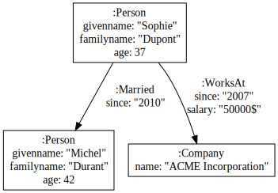

# Quick overview of what PREC can do


PREC enables to convert PG into RDF. Unlike other tools, PREC enables the user to choose the modelization.

## Quick example


### Example 1

Let us consider that we have the following property graph, stored in the [data\ex2_annlikesdan1.json](data\ex2_annlikesdan1.json) file:


PREC enables to convert the PG depending of a mapping.

For example, by using the mapping described by file [data\ex2_anndan_prsc.ttl](data\ex2_anndan_prsc.ttl):

```ttl
PREFIX prec: <http://bruy.at/prec#>
PREFIX pvar: <http://bruy.at/prec-trans#>
PREFIX ex:   <http://example.org/>
PREFIX rdf:  <http://www.w3.org/1999/02/22-rdf-syntax-ns#>

prec:this_is a prec:prscContext .

# A first form that matches some nodes
ex:PersonForm a prec:prsc_node ;  # If a PG element is an node
  prec:nodeLabel "Person" ;       # Whose label is person
  prec:propertyName "name" ;      # And that has the name property
  # Then build the following triples:
  prec:composedOf
    # _:thisnode ex:hasLabel ex:person
    << pvar:node ex:hasLabel ex:person >> , 
    # _:thisnode ex:name "The value of the name property"
    << pvar:node ex:name "name"^^prec:_valueOf >> .
    # _:thisnode being a distinct blank node for each node


# Another form that matches edges
ex:LovesForm a prec:prsc_edge ;   # If a PG element is an edge
  prec:edgeLabel "Likes" ;        # And has the likes label
  # Then build the following triples
  prec:composedOf
    # _:thisEdge rdf:type ex:Like
    << pvar:edge rdf:type ex:Like >>,
    # _:thisEdge ex:from _:theSourceNode
    << pvar:edge ex:from pvar:source >>,
    # _:thisEdge ex:content_producer _:theDestinationNode
    << pvar:edge ex:content_producer pvar:destination >> .
```

This RDF graph is produced:

`npx ts-node prec.ts apoc2rdf data\ex2_annlikesdan1.json -c data\ex2_anndan_prsc_wb.ttl`

```ttl

_:node9 <http://example.org/hasLabel> <http://example.org/person>;
    <http://example.org/name> "Ann".
_:node10 <http://example.org/hasLabel> <http://example.org/person>;
    <http://example.org/name> "Dan".
_:edge12 a <http://example.org/Like>;
    <http://example.org/from> _:node9;
    <http://example.org/content_producer> _:node10.

```

Note that the Ann node has been mapped to `_:node9`, the Dan node has been mapped to `_:node10` and the edge has been mapped to `_:edge12`.

Some users may consider that this mapping is not very interesting.


### Example 2: Less triples

For the same PG


We will use instead this context described by file [data\ex2_anndan_prsc.ttl](data\ex2_anndan_prsc.ttl):


```ttl
PREFIX prec: <http://bruy.at/prec#>
PREFIX pvar: <http://bruy.at/prec-trans#>
PREFIX ex:   <http://example.org/>
PREFIX rdf:  <http://www.w3.org/1999/02/22-rdf-syntax-ns#>

prec:this_is a prec:prscContext .

ex:PersonForm a prec:prsc_node ;
  prec:nodeLabel "Person" ;
  prec:propertyName "name" ;
  prec:composedOf
    << pvar:node rdf:type ex:Person >> ,
    << pvar:node ex:name "name"^^prec:_valueOf >> .

ex:LovesForm a prec:prsc_edge ;
  prec:edgeLabel "Likes" ;
  prec:composedOf
    << pvar:source ex:likes pvar:destination >> .
```

Note that only the `ex:LoveForm` rule has changed, so only the part of the RDF graph related to the edge has changed:


``npx ts-node prec.ts apoc2rdf data\ex2_annlikesdan1.json -c data\ex2_anndan_prsc.ttl``

```ttl
@prefix rdf: <http://www.w3.org/1999/02/22-rdf-syntax-ns#>.
@prefix rdfs: <http://www.w3.org/2000/01/rdf-schema#>.
@prefix prec: <http://bruy.at/prec#>.

_:node9 a <http://example.org/Person>;
    <http://example.org/name> "Ann".
_:node10 a <http://example.org/Person>;
    <http://example.org/name> "Dan".

_:node9 <http://example.org/likes> _:node10 .
```


### Example 3: RDF-star


We now consider this new Property Graph, stored in file [data\sophie_example.json](data\sophie_example.json), that we want to translate by using the [schema.org](https://schema.org) ontology.



It is possible by using this context [data\sophie_example.ttl](data\sophie_example.ttl):

```ttl
PREFIX prec: <http://bruy.at/prec#>
PREFIX pvar: <http://bruy.at/prec-trans#>
PREFIX schema:   <https://schema.org/>
PREFIX ex:   <http://www.example.org/>
PREFIX rdf:  <http://www.w3.org/1999/02/22-rdf-syntax-ns#>

prec:this_is a prec:prscContext .

ex:Person a prec:prsc_node ;
  prec:nodeLabel "Person" ;
  prec:propertyName "givenname", "familyname", "age" ;
  prec:composedOf
    << pvar:node rdf:type schema:Person >> ,
    << pvar:node schema:givenName  "givenname"^^prec:_valueOf  >> ,
    << pvar:node schema:familyName "familyname"^^prec:_valueOf >> .

ex:Company a prec:prsc_node ;
  prec:nodeLabel "Company" ;
  prec:propertyName "name" ;
  prec:composedOf
    << pvar:node rdf:type schema:Organization >> ,
    << pvar:node schema:name "name"^^prec:_valueOf >> .

ex:Married a prec:prsc_edge ;
  prec:edgeLabel "Married" ;
  prec:propertyName "since" ;
  prec:composedOf
    << pvar:source schema:spouse pvar:destination >> ,
    << << pvar:source schema:spouse pvar:destination >>
          schema:startDate "since"^^prec:_valueOf >> .

ex:WorksAt a prec:prsc_edge ;
  prec:edgeLabel "WorksAt" ;
  prec:propertyName "since", "salary" ;
  prec:composedOf
    << pvar:destination schema:employee pvar:edge >> ,
    << pvar:edge rdf:type schema:EmployeeRole >> ,
    << pvar:edge schema:baseSalary "salary"^^prec:_valueOf >> ,
    << pvar:edge schema:startDate  "since"^^prec:_valueOf >> ,
    << pvar:edge schema:employee   pvar:source >> .

```


To produce the following RDF graph:

`npx ts-node prec.ts apoc2rdf data\sophie_example.json -c data\sophie_example.ttl`

```ttl
# A person: Sophie
_:node1 a <https://schema.org/Person>;
    <https://schema.org/givenName> "Sophie";
    <https://schema.org/familyName> "Dupont";
    <https://schema.org/spouse> _:node2.

# Another person: Michel
_:node2 a <https://schema.org/Person>;
    <https://schema.org/givenName> "Michel";
    <https://schema.org/familyName> "Durant".

# The ACME incorporation company
_:node3 a <https://schema.org/Organization>;
    <https://schema.org/name> "ACME Incorporation";
    <https://schema.org/employee> _:edge5.

# Using EmployeeRole as a way to reify the edge
_:edge5 a <https://schema.org/EmployeeRole>;
    <https://schema.org/employee> _:node1;
    <https://schema.org/baseSalary> "50000$";
    <https://schema.org/startDate> "2007".

# Using RDF star for the start date of the marriage
<<_:node1 <https://schema.org/spouse> _:node2>> <https://schema.org/startDate> "2010".
```


