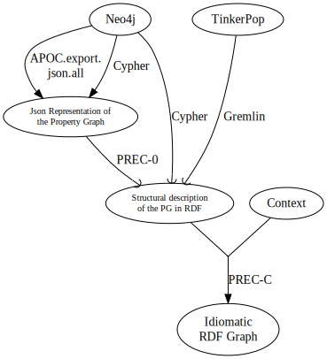

# PG->RDF Experimental Converter

PREC is a WIP set of tools to convert any Property Graph into RDF.

Its main differences with other converters are:
- It intends to convert the PG into RDF graphs that looks like RDF graphs, by
limiting the amount of boilterplate due to the data being from a Property Graph
- It enables the user to map some of the labels and prorpety names used in the
PG to an existing vocabulary, by providing a *context* written in Turtle format.

PREC uses the PREC ontology that is described at https://bruy.at/prec. The PREC
ontology is mostly used to describe how to convert an RDF graph generated by
PREC with its default model into a more user friendly graph.

## Quick start

- `npm install`

- Example 1: A Property Graph with a node about Joe Biden
    - `node prec.js data\joe_biden.json data\joe_biden.ttl`
    - `data\joe_biden.json` contains the exportation of a Neo4J Property Graph
    about Joe Biden and the USA.
    - `data\joe_biden.ttl` is a context. *In this project, we call a*
    *Context a Turtle File that describes a mapping from the elements of Property*
    *Graph to an RDF ontology*. This context maps labels of the PG into IRIs
    mainly from DBpedia and Schema.org

- Example 2: The node Ann likes the node Dan
    - `node prec.js data\annlikesdan1.json data\anndan.ttl`

## Current tools / entry points

**PG -> RDF**

- `prec.js` translates Property Graphs to RDF. The input is the result of some
operations that the user have to do.
- `neo4j-to-rdf.js` translates Property Graphs from Neo4J to RDF. Unlike
`prec.js`, this tool connects itself to the Neo4J instance to extract the nodes
and relationships (named edges in the rest of PREC).
- `gremlin-to-rdf.js` translates "Tinkerpop enabled" property graphs to RDF. It
works by connecting to the Gremlin API and making requests to extract the graph.

**RDF -> PG**

- `rdf-to-pg.js` allows to come back to Property Graphs from a RDF previously
generated by `prec` or `neo4j-to-rdf`.

**Tools**

- `tools.js` provides various tools like applying a context to an RDF 

## Converting your own Property Graph to RDF

The easiest way to transform a Property Graph is by providing a Cypher or a
Gremlin connection, and eventually a *Context* to get a nicer output.

In the graph, an arrow means the step ends here, a hook means the process
will continue.

For example, if you provide a Gremlin connection, you will get an "Usable RDF
Graph" (if you didn't provide a context, the Usable RDF Graph is equals to the
Expanded RDF Graph).

### From Neo4j

#### With the result of a Cypher query

Run a Cypher query like this one:
- `match (src)-[edge]->(dest) return src,edge,dest LIMIT 5`
- The return instruction must return nodes and edges.
    - you can't write src.myProperty
- Get the result in JSON format (in Neo4J Browser : choose Export JSON after running the query)
- Pass the `-f=Neo4JCypher` option when running the command line, for example if your output file is `data\movies_cypher_all.json`
    - `node prec.js data\movies_cypher_all.json -f=Neo4JCypher (context path if you have one)`

#### By letting PREC connect to the Neo4j database

You can also extract directly the graph from your Neo4J database.

- `node neo4j-to-rdf.js username password (uri-to-your-neo4j-instance) (-c=contextfile.ttl)`

Default username should be neo4j and password is the one you entered when
creating the database. Default uri is the local instance with the default Neo4j
parameters.

#### From a Json Representation of the Property Graph using APOC

You can also use the APOC plugin to extract the content of your Property Graph.

To export a Neo4J property graph from your database, you need to activate APOC file export:
- Go in your database configuration (click the ... right to the database name -> Manage)
- Plugins -> Install APOC
- Settings -> add `set apoc.export.file.enabled=true` -> Apply

To export the graph structure, use this Cypher instruction: 
`CALL apoc.export.json.all("propertygraph.json",{useTypes:true})`

<!--
(An easy (and hack-y) way to find where the file is is to use an invalid path like `CALL apoc.export.json.all("/this/is/invalid",{useTypes:true})` so the Java exception tells the complete path )
-->

- `node prec.js /path/to/your/propertygraph.json` will output the *Expanded RDF Graph*
from the *Json Representation of the Property Graph*.

### From TinkerPop

(WIP)

`node gremlin-to-rdf.js (URI to connect to) [-c Context]`

Default URI is the URI of a local TinkerPop Server.

### Misc.

- [The data folder](data) contains Neo4J (small) exported property graphs.

## License

TBD
