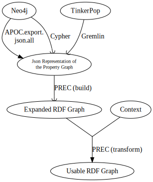

# PG->RDF Experimental Converter

Some experiments about PG to RDF conversion.

## Quick start

- `npm install`

- `node prec.js data\joe_biden.json data\joe_biden_schema.ttl`
    - `data\joe_biden.json` contains the exportation of a Neo4J Property Graph concerning Joe Biden and the USA.
    - `data\joe_biden_schema.ttl` is a context which maps the labels of the PG into IRIs mainly from DBpedia and Schema.org

- `node prec.js data\annlikesdan1.json data\anndan.ttl`
    - (WIP)

### Less quick start

- [The data folder](data) contains Neo4J (small) exported property graphs.

## Converting your own Property Graph to RDF

Currently, only Neo4j graphs are supported

## From Neo4j (converting a Neo4j Property Graph into a Json representation of the tile)

To export a Neo4J property graph from your database, you need to activate APOC file export:
- Go in your database configuration (click the ... right to the database name -> Manage)
- Plugins -> Install APOC
- Settings -> add `set apoc.export.file.enabled=true` -> Apply

To export the graph structure, use this cypher instruction
`CALL apoc.export.json.all("propertygraph.json",{useTypes:true})`

An easy (and hack-y) way to find where the file is is to use an invalid path like
`CALL apoc.export.json.all("/this/is/invalid",{useTypes:true})`
so the Java exception tells the complete path

**TODO:** `apoc.import.file.use_neo4j_config=false` to use absolute paths?

## Running the script itself

- `node prec.js /path/to/your/propertygraph.json` will output the *Expanded RDF Graph*
from the *Json Representation of the Property Graph*.

## Using a context

You can write a context in Turtle format and use it to output an *Usable RDF Graph*
from the *Json Representation of the Property Graph*.

- `node prec.js /path/to/your/propertygraph.json /path/to/your/context.ttl`

